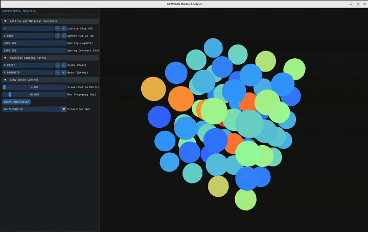

# nCMCMA (non-Continuous-Material Cube Modal Analysis)

<!-- Release & Downloads Badges -->
[](https://github.com/suacayipkisi/nCMCMA/releases/latest)
[](https://github.com/suacayipkisi/nCMCMA/releases)

---

## 📦 Downloads (v0.1.0-alpha)

Pre-compiled binary releases for Linux and Windows are available under [GitHub Releases](https://github.com/suacayipkisi/nCMCMA/releases/tag/v0.1.0-alpha).

| Platform | File | Quick Run Command |
| :--- | :--- | :--- |
| **Linux** (All Distros) | [`ncmcma-v0.1.0-alpha-linux-x64.tar.gz `](https://github.com/suacayipkisi/nCMCMA/releases/download/v0.1.0-alpha/ncmcma-v0.1.0-alpha-linux-x64.tar.gz) | Copy this whole command in terminal: `cd Downloads && tar -xzvf ncmcma-v0.1.0-alpha-linux-x64.tar.gz && ./ncmcma-v0.1.0-alpha-linux-x64/run.sh` |
| **Windows** (10/11 x64) | [`ncmcma-v0.1.0-alpha-win64.zip`](https://github.com/suacayipkisi/nCMCMA/releases/download/v0.1.0-alpha/ncmcma-v0.1.0-alpha-win64.zip) | Extract `.zip` and run `ncmcma.exe` |

---

nCMCMA is designed for the structural modal analysis and dynamic response simulation of 3D non-continuous material cube structures (mass-spring lattice models).

The software constructs global Mass ($M$), Stiffness ($K$), and Rayleigh Damping ($C$) matrices for a discretized $N \times N \times N$ mass-spring system with 6 degrees of freedom (DOF) per mass element. It solves state-space eigenvalue problems and computes frequency-domain receptance matrices and dynamic displacements ($q = \alpha(\omega) \cdot Q$) with OpenMP multi-threading acceleration.  

Calculates natural frequency with iteration, older verison were calculating all natural frequencies but this takes too much time and really high RAM usage and segmentation faults (for massNum = 16 -> ~19GB, but now it takes a few houndred MB). This iteration results may looks like natural freq. values too close but this is not a mistake. This model is not fem(finite element method). The lattice structure causes this. Still if you increase massNum, time increase exponentally but ram usage is npt that much because of the iteration algotihm.

The simulation may not show the springs but I draw an example.

---

## Structural Sample Model for a $2 \times 2 \times 2$ mass lattice

Below is an illustration of a $2 \times 2 \times 2$ mass lattice (massNum{2}) configuration with interconnected spring-damper elements:


---

## Features

* **3D Mass-Spring Lattice Generation:** Flexible setup for $N \times N \times N$ discrete cube structures with 6 DOFs per node (3 translational + 3 rotational).
* **State-Space Formulation:** Conversion of system matrices into $2N \times 2N$ state-space representation for precise eigenvalue and natural frequency extraction.
* **Rayleigh Damping Integration:** Material-specific Rayleigh damping matrix calculation ($\mathbf{C} = \alpha \mathbf{M} + \beta \mathbf{K}$).
* **Receptance Matrix Computation:** Computes frequency-dependent transfer function matrices $\boldsymbol{\alpha}(\omega) = (\mathbf{K} - \omega^2 \mathbf{M} + i \omega \mathbf{C})^{-1}$ using Eigen's `FullPivLU` solver.
* **Dynamic Load Response ($q = \alpha(\omega) Q$):** Calculates complex spatial displacements and magnitudes across all DOFs under applied dynamic forces.
* **Multi-Threaded Parallel Execution:** Utilizes **OpenMP** and **Eigen** parallelization, automatically scaled to half of system hardware threads for optimal performance and thermal efficiency.
* **Visualization:** with imgui and opengl, colored spheres according to their displacement. Shows element has higher displacement red (doesn't animates strings for better look, only sphere mass-elements)

---

## Screenshot From GUI



---

## Project Structur

```text
nCMCMA/
├── CMakeLists.txt              # Build configuration with C++23, Eigen3 & OpenMP
├── main.cpp                    # Application entry point & parallel analysis runner
├── 2_2_2_cubeSample.png        # Sample lattice model diagram
└── src/
    ├── engine
    │   ├── simEngine.cpp           # parallel analysis runner
    │   └── simEngine.h
    ├── gui
    │   ├── gui.cpp                 # visualize the results
    │   └── gui.h
    ├── matrixOperations/
    │   ├── stdEigenValueSolver.h
    │   └── stdEigenValueSolver.cpp # Eigen-based eigenvalue solver & frequency extractor
    └── modalAnalysis/
        ├── massMatrix.h
        ├── massMatrix.cpp          # Mass matrix generation (6 DOF / node)
        ├── stiffMatrix.h
        └── stiffMatrix.cpp         # Stiffness matrix assembly
```

---

## Prerequisites

* **C++ Compiler:** C++23 support (e.g., `g++ 12+` or `clang 14+`)
* **Build System:** CMake `3.22` or higher
* **Libraries:**
  * **Eigen 3.3+** (Linear algebra library)
  * **OpenMP** (Multi-threading support)

### Installing Dependencies

There are 4 dependencies: openGL for animation, imGui for gui, Eigen for matrix computations, openMP for multithreading.

#### Ubuntu/Debian

```bash
sudo apt update
sudo apt install -y build-essential cmake ninja-build g++-13 libeigen3-dev libglfw3-dev libgl1-mesa-dev libglu1-mesa-dev libomp-dev
```

#### Fedora

```bash
sudo dnf check-update
sudo dnf install -y @development-tools cmake ninja-build gcc-c++ eigen3-devel glfw-devel mesa-libGL-devel mesa-libGLU-devel libomp-devel
```

#### Arch/CachyOS

```bash
sudo pacman -Syu --needed base-devel cmake ninja gcc eigen glfw-x11 mesa openmp
```

#### Windows

in PowerShell

```powershell
git clone https://github.com/microsoft/vcpkg.git
cd vcpkg
.\bootstrap-vcpkg.bat
.\vcpkg integrate install
```

```powershell
.\vcpkg install eigen3:x64-windows
.\vcpkg install glfw3:x64-windows
.\vcpkg install glad:x64-windows
```

---

## Building & Running

### 1. Configure and Build

```bash
cmake -B build -S .
cmake --build build
```

for windows

```powershell
cmake -B build -S . -DCMAKE_TOOLCHAIN_FILE="C:/vcpkg/scripts/buildsystems/vcpkg.cmake"
cmake --build build --config Debug
```

### 2. Run Execution

```bash
./build/ncmcma
```

---

## 📊 Mathematical Formulation

1. **Governing Equation:**
   $$\mathbf{M} \ddot{\mathbf{x}}(t) + \mathbf{C} \dot{\mathbf{x}}(t) + \mathbf{K} \mathbf{x}(t) = \mathbf{Q}(t)$$

2. **Receptance Matrix ( $\boldsymbol{\alpha}(\omega)$ ):**
   $$\boldsymbol{\alpha}(\omega) = \left( \mathbf{K} - \omega^2 \mathbf{M} + i \omega \mathbf{C} \right)^{-1}$$

3. **Dynamic Response Calculation ($q$):**
   $$\mathbf{q}(\omega) = \boldsymbol{\alpha}(\omega) \cdot \mathbf{Q}(\omega)$$

## Process Flow

$$\begin{matrix} K, M \xrightarrow{\text{Diagonal Transformation}} S = M^{-1/2} K M^{-1/2} \end{matrix}$$  

$$\begin{matrix} A = S + I \xrightarrow{\text{LDLT Decomposition}} A = L D L^T \end{matrix}$$  

$$\begin{matrix} \text{25 x Iter: } V_k = A^{-1} Q_k \xrightarrow{\text{QR}} Q_{k+1} \end{matrix}$$  

$$\begin{matrix} T = Q^T S Q \xrightarrow{\text{Rayleigh-Ritz}} \text{eig}(T) \rightarrow \lambda \end{matrix}$$  

$$\begin{matrix} \omega = \sqrt{\lambda} \end{matrix}$$  
