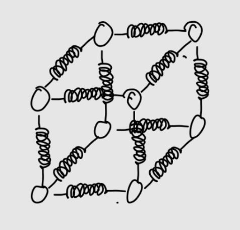

# nCMMA (non-Continuous-Material Cube Modal Analysis)

nCMMA is designed for the structural modal analysis and dynamic response simulation of 3D non-continuous material cube structures (mass-spring lattice models).

The software constructs global Mass ($M$), Stiffness ($K$), and Rayleigh Damping ($C$) matrices for a discretized $N \times N \times N$ mass-spring system with 6 degrees of freedom (DOF) per mass element. It solves state-space eigenvalue problems and computes frequency-domain receptance matrices and dynamic displacements ($q = \alpha(\omega) \cdot Q$) with OpenMP multi-threading acceleration.

---

## Structural Sample Model for a $2 \times 2 \times 2$ mass lattice

Below is an illustration of a $2 \times 2 \times 2$ mass lattice (massNum{2}) configuration with interconnected spring-damper elements:



---

## Features

* **3D Mass-Spring Lattice Generation:** Flexible setup for $N \times N \times N$ discrete cube structures with 6 DOFs per node (3 translational + 3 rotational).
* **State-Space Formulation:** Conversion of system matrices into $2N \times 2N$ state-space representation for precise eigenvalue and natural frequency extraction.
* **Rayleigh Damping Integration:** Material-specific Rayleigh damping matrix calculation ($\mathbf{C} = \alpha \mathbf{M} + \beta \mathbf{K}$).
* **Receptance Matrix Computation:** Computes frequency-dependent transfer function matrices $\boldsymbol{\alpha}(\omega) = (\mathbf{K} - \omega^2 \mathbf{M} + i \omega \mathbf{C})^{-1}$ using Eigen's `FullPivLU` solver.
* **Dynamic Load Response ($q = \alpha(\omega) Q$):** Calculates complex spatial displacements and magnitudes across all DOFs under applied dynamic forces.
* **Multi-Threaded Parallel Execution:** Utilizes **OpenMP** and **Eigen** parallelization, automatically scaled to half of system hardware threads for optimal performance and thermal efficiency.
* **Formatted File Output:** Exports full receptance matrices to `receptance_matrix.txt` and displacement results to `displacement.txt`.

---

## Project Structur

```text
nCMMA/
├── CMakeLists.txt              # Build configuration with C++23, Eigen3 & OpenMP
├── main.cpp                    # Application entry point & parallel analysis runner
├── 2_2_2_cubeSample.png        # Sample lattice model diagram
└── src/
    ├── matrixOperations/
    │   ├── stdEigenValueSolver.h   # Eigen-based eigenvalue solver & frequency extractor
    │   └── stdEigenValueSolver.cpp
    └── modalAnalysis/
        ├── massMatrix.h           # Mass matrix generation (6 DOF / node)
        ├── massMatrix.cpp
        ├── stiffMatrix.h          # Stiffness matrix assembly
        └── stiffMatrix.cpp
```

---

## Prerequisites

* **C++ Compiler:** C++23 support (e.g., `g++ 12+` or `clang 14+`)
* **Build System:** CMake `3.22` or higher
* **Libraries:**
  * **Eigen 3.3+** (Linear algebra library)
  * **OpenMP** (Multi-threading support)

### Installing Dependencies (probably not necessary)

#### Ubuntu/Debian

```bash
sudo apt update
sudo apt install build-essential cmake libeigen3-dev libomp-dev
```

---

## Building & Running

### 1. Configure and Build

```bash
cmake -B build -S .
cmake --build build
```

### 2. Run Execution

```bash
./build/ncmma
```

### 3. Output Files Generated

* `displacement.txt`: Dynamic displacement response per DOF showing real/imaginary parts and overall magnitude ($|q|$).

---

## 📊 Mathematical Formulation

1. **Governing Equation:**
   $$\mathbf{M} \ddot{\mathbf{x}}(t) + \mathbf{C} \dot{\mathbf{x}}(t) + \mathbf{K} \mathbf{x}(t) = \mathbf{Q}(t)$$

2. **Receptance Matrix ( $\boldsymbol{\alpha}(\omega)$ ):**
   $$\boldsymbol{\alpha}(\omega) = \left( \mathbf{K} - \omega^2 \mathbf{M} + i \omega \mathbf{C} \right)^{-1}$$

3. **Dynamic Response Calculation ($q$):**
   $$\mathbf{q}(\omega) = \boldsymbol{\alpha}(\omega) \cdot \mathbf{Q}(\omega)$$

## Process Flow

$$\begin{matrix} K, M \xrightarrow{\text{Diagonal Transformation}} S = M^{-1/2} K M^{-1/2} \end{matrix}$$  

$$\begin{matrix} A = S + I \xrightarrow{\text{LDLT Decomposition}} A = L D L^T \end{matrix}$$  

$$\begin{matrix} \text{25 x Iter: } V_k = A^{-1} Q_k \xrightarrow{\text{QR}} Q_{k+1} \end{matrix}$$  

$$\begin{matrix} T = Q^T S Q \xrightarrow{\text{Rayleigh-Ritz}} \text{eig}(T) \rightarrow \lambda \end{matrix}$$  

$$\begin{matrix} \omega = \sqrt{\lambda} \end{matrix}$$  
